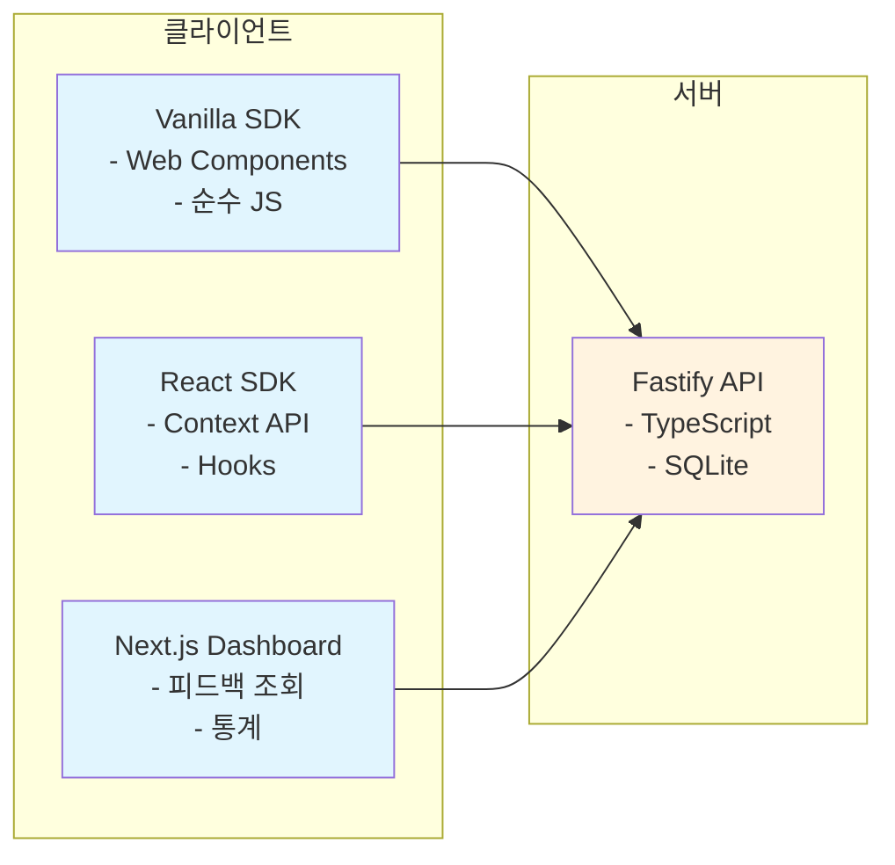

# Feedback SDK

사용자 피드백을 쉽게 수집할 수 있는 모던 SDK 시스템입니다.

## 시스템 구조



## 프로젝트 구조

```
feedback/
├── packages/
│   ├── shared/              # 공통 타입, API 클라이언트
│   ├── vanilla/            # 순수 JS SDK (Web Components)
│   └── react/              # React SDK (Context + Hooks)
├── apps/
│   ├── server/             # Fastify API 서버 + SQLite
│   └── dashboard/          # Next.js 관리 대시보드
├── examples/               # 사용 예시
├── pnpm-workspace.yaml
├── package.json
└── tsconfig.json
```

## 핵심 설정

### pnpm-workspace.yaml
```yaml
packages:
  - 'packages/*'
  - 'apps/*'
  - 'examples/*'
```

### package.json (루트)
```json
{
  "name": "feedback-system",
  "private": true,
  "type": "module",
  "scripts": {
    "build": "pnpm -r --filter='!examples/*' build",
    "dev": "pnpm -r --parallel dev",
    "dev:server": "pnpm --filter=server dev",
    "dev:dashboard": "pnpm --filter=dashboard dev"
  }
}
```

## 빠른 시작

### 설치
```bash
pnpm install
```

### 개발 환경 실행
```bash
# 전체 시스템 실행
pnpm dev

# 개별 실행
pnpm dev:server    # API 서버만
pnpm dev:dashboard # 대시보드만
```

### 빌드
```bash
pnpm build
```

## 사용 방법

### 1. Vanilla JavaScript

```html
<!DOCTYPE html>
<html>
<head>
  <title>My App</title>
</head>
<body>
  <div id="app">
    <!-- 앱 콘텐츠 -->
  </div>

  <script type="module">
    import { initFeedback } from './dist/vanilla/index.js'
    
    initFeedback({
      apiKey: 'your-api-key',
      apiUrl: 'http://localhost:3001',
      position: 'bottom-right'
    })
  </script>
</body>
</html>
```

### 2. React

```jsx
import { FeedbackProvider } from '@feedback/react'

function App() {
  return (
    <FeedbackProvider config={{
      apiKey: 'your-api-key',
      apiUrl: 'http://localhost:3001'
    }}>
      <div className="app">
        {/* 앱 콘텐츠 */}
        <Header />
        <Main />
      </div>
    </FeedbackProvider>
  )
}
```

### 3. Next.js

```jsx
// pages/_app.js
import { FeedbackProvider } from '@feedback/react'

export default function MyApp({ Component, pageProps }) {
  return (
    <FeedbackProvider config={{
      apiKey: process.env.NEXT_PUBLIC_FEEDBACK_KEY,
      apiUrl: process.env.NEXT_PUBLIC_FEEDBACK_API_URL
    }}>
      <Component {...pageProps} />
    </FeedbackProvider>
  )
}
```

## API 설정

### 환경변수

```bash
# apps/server/.env
JWT_SECRET=your-secret-key
PORT=3001
```

### 기본 엔드포인트

- `POST /api/feedback` - 피드백 제출
- `GET /api/feedback` - 피드백 목록 조회

## 개발 도구

- **TypeScript**: 전체 타입 안전성
- **pnpm**: 빠른 패키지 관리
- **Biome**: 린팅 + 포매팅 (선택적)
- **tsup**: 빠른 빌드
- **Fastify**: 고성능 웹 프레임워크
- **SQLite**: 임베디드 데이터베이스

## 라이선스

MIT